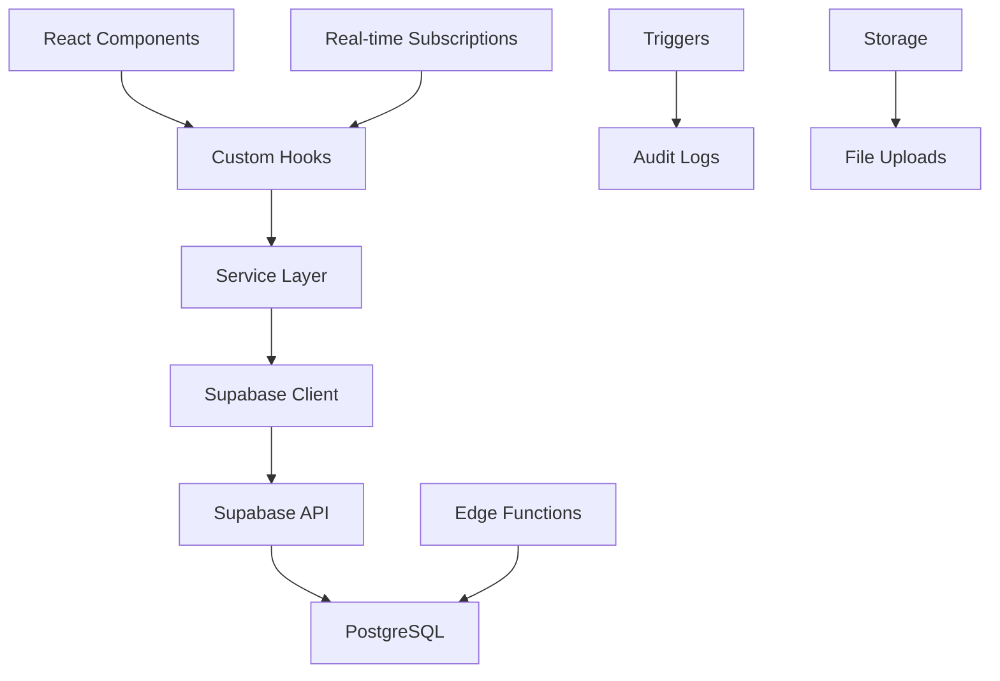

# IMS System Architecture

## Overview

The Internal Management System (IMS) for Public Housing Suriname is built as a modern web application using React/TypeScript frontend with Supabase backend, integrated seamlessly with the existing Darkone admin template.

## Technology Stack

### Frontend Layer
- **Framework**: React 18.3.1 with TypeScript
- **Build Tool**: Vite for fast development and optimized builds
- **UI Framework**: Bootstrap 5.3.8 + Darkone Admin Template
- **Styling**: SCSS with existing Darkone theme system
- **State Management**: React Query for server state, React Hook Form for forms
- **Routing**: React Router DOM v7.0.2
- **Validation**: Yup schema validation
- **File Uploads**: React Dropzone integration
- **Date Handling**: React Flatpickr for scheduling
- **Charts**: ApexCharts for analytics and reporting
- **Tables**: GridJS for data tables with sorting/filtering
- **Notifications**: React Toastify

### Backend Layer
- **Database**: PostgreSQL via Supabase
- **Authentication**: Supabase Auth with role-based access
- **API**: Supabase REST API + Custom Edge Functions
- **File Storage**: Supabase Storage with signed URLs
- **Real-time**: Supabase Real-time subscriptions
- **Workflow Engine**: Custom Edge Functions for state machine
- **Audit Logging**: Immutable audit trail with triggers

### Infrastructure
- **Hosting**: Lovable deployment platform
- **Database**: Supabase managed PostgreSQL
- **CDN**: Supabase CDN for static assets
- **Monitoring**: Supabase Analytics + Custom metrics
- **Backups**: Automated daily backups via Supabase

## Project Structure

```
src/
├── app/
│   ├── (admin)/
│   │   ├── ims/                    # IMS module routes
│   │   │   ├── applications/       # Application management
│   │   │   │   ├── create/
│   │   │   │   ├── list/
│   │   │   │   └── [id]/
│   │   │   ├── control/           # Control department
│   │   │   │   ├── schedule/
│   │   │   │   ├── visits/
│   │   │   │   └── reports/
│   │   │   ├── reviews/           # Technical & social reviews
│   │   │   │   ├── technical/
│   │   │   │   └── social/
│   │   │   ├── decisions/         # Director & minister decisions
│   │   │   │   ├── director/
│   │   │   │   └── minister/
│   │   │   ├── reports/           # Analytics & reporting
│   │   │   │   ├── analytics/
│   │   │   │   └── export/
│   │   │   └── admin/             # System administration
│   │   │       ├── users/
│   │   │       ├── roles/
│   │   │       └── settings/
│   │   └── [existing darkone routes]/
│   └── (other)/
│       └── auth/                  # Authentication pages
├── components/
│   ├── ims/                       # IMS-specific components
│   │   ├── applications/
│   │   │   ├── ApplicationForm.tsx
│   │   │   ├── ApplicationCard.tsx
│   │   │   ├── ApplicationDetail.tsx
│   │   │   └── ApplicationSearch.tsx
│   │   ├── control/
│   │   │   ├── ControlScheduler.tsx
│   │   │   ├── ControlVisit.tsx
│   │   │   ├── PhotoCapture.tsx
│   │   │   └── ControlReport.tsx
│   │   ├── reviews/
│   │   │   ├── TechnicalReport.tsx
│   │   │   ├── SocialReport.tsx
│   │   │   └── IncomeVerification.tsx
│   │   ├── decisions/
│   │   │   ├── DirectorDashboard.tsx
│   │   │   ├── DecisionPackage.tsx
│   │   │   └── MinisterDecision.tsx
│   │   ├── shared/
│   │   │   ├── DocumentUpload.tsx
│   │   │   ├── StatusBadge.tsx
│   │   │   ├── WorkflowTracker.tsx
│   │   │   └── AuditTrail.tsx
│   │   └── admin/
│   │       ├── UserManagement.tsx
│   │       ├── RoleAssignment.tsx
│   │       └── SystemSettings.tsx
│   ├── [existing darkone components]/
│   ├── layout/                    # Layout components
│   └── wrapper/                   # Provider wrappers
├── hooks/
│   ├── ims/                       # IMS-specific hooks
│   │   ├── useApplications.ts
│   │   ├── useWorkflow.ts
│   │   ├── useDocuments.ts
│   │   ├── useControlVisits.ts
│   │   └── useAuditLogs.ts
│   └── [existing hooks]/
├── services/
│   ├── ims/                       # IMS API services
│   │   ├── applicationService.ts
│   │   ├── documentService.ts
│   │   ├── controlService.ts
│   │   ├── reportService.ts
│   │   └── auditService.ts
│   └── supabase.ts               # Supabase client
├── types/
│   ├── ims/                       # IMS type definitions
│   │   ├── application.ts
│   │   ├── document.ts
│   │   ├── control.ts
│   │   ├── report.ts
│   │   └── workflow.ts
│   └── [existing types]/
├── utils/
│   ├── ims/                       # IMS utilities
│   │   ├── workflow.ts
│   │   ├── validation.ts
│   │   ├── permissions.ts
│   │   └── formatting.ts
│   └── [existing utils]/
└── assets/
    ├── data/
    │   └── ims/                   # IMS configuration data
    │       ├── documentTypes.ts
    │       ├── workflows.ts
    │       └── permissions.ts
    └── [existing assets]/
```

## Component Architecture

### Component Hierarchy

```
App
├── AppProvidersWrapper
│   ├── AuthProvider (Supabase Auth)
│   ├── QueryProvider (React Query)
│   ├── NotificationProvider
│   └── LayoutProvider (Darkone Theme)
└── AppRouter
    ├── AdminLayout (for IMS routes)
    │   ├── TopNavigationBar
    │   ├── VerticalNavigationBar
    │   └── IMS Module Components
    └── AuthLayout (for login/logout)
```

### IMS Component Patterns

#### Container Components
- Handle data fetching and state management
- Connect to Supabase via custom hooks
- Manage component lifecycle and effects
- Handle error boundaries and loading states

#### Presentation Components
- Pure components that receive props
- Use existing Darkone styling exclusively
- Focus on UI rendering and user interaction
- Minimal internal state (only UI state)

#### Hook Pattern
```typescript
// Custom hook for applications
export const useApplications = () => {
  const queryClient = useQueryClient()
  
  const applications = useQuery({
    queryKey: ['applications'],
    queryFn: () => applicationService.getAll()
  })
  
  const createApplication = useMutation({
    mutationFn: applicationService.create,
    onSuccess: () => {
      queryClient.invalidateQueries(['applications'])
      toast.success('Application created successfully')
    }
  })
  
  return { applications, createApplication }
}
```

## Data Flow Architecture

### Client-Server Communication



### State Management Strategy

#### Server State (React Query)
- Application data
- Document metadata
- User profiles and roles
- Workflow states and tasks
- Audit logs and reports

#### Client State (React State)
- Form input values
- UI state (modals, dropdowns)
- Navigation state
- Temporary file uploads
- Search and filter criteria

#### Persistent State (Local Storage)
- User preferences
- Draft form data
- Theme settings
- Table configurations

## Service Layer Architecture

### API Service Pattern
```typescript
// Base service class
abstract class BaseService<T> {
  protected supabase = supabaseClient
  protected tableName: string
  
  async getAll(): Promise<T[]> {
    const { data, error } = await this.supabase
      .from(this.tableName)
      .select('*')
    
    if (error) throw error
    return data
  }
  
  async create(item: Partial<T>): Promise<T> {
    const { data, error } = await this.supabase
      .from(this.tableName)
      .insert(item)
      .select()
      .single()
    
    if (error) throw error
    return data
  }
}

// Specific service implementation
class ApplicationService extends BaseService<Application> {
  protected tableName = 'applications'
  
  async getByStatus(status: ApplicationStatus): Promise<Application[]> {
    const { data, error } = await this.supabase
      .from(this.tableName)
      .select(`
        *,
        applicant:applicants(*),
        documents:documents(*),
        control_visits(*)
      `)
      .eq('status', status)
    
    if (error) throw error
    return data
  }
  
  async updateStatus(id: string, status: ApplicationStatus): Promise<void> {
    // Call workflow transition Edge Function
    const { error } = await this.supabase.functions.invoke('workflow-transition', {
      body: { application_id: id, new_status: status }
    })
    
    if (error) throw error
  }
}
```

## Security Architecture

### Authentication Flow
1. User login via Supabase Auth (email/password)
2. JWT token includes user ID and role claims
3. Role verified against profiles table
4. Route guards check permissions
5. Component-level access control

### Authorization Model
```typescript
// Permission checking utility
export const hasPermission = (
  userRole: UserRole,
  action: string,
  resource: string,
  context?: any
): boolean => {
  const permissions = ROLE_PERMISSIONS[userRole]
  
  // Check basic permission
  if (!permissions[resource]?.includes(action)) {
    return false
  }
  
  // Check contextual permissions
  if (context) {
    return checkContextualPermission(userRole, action, resource, context)
  }
  
  return true
}

// Usage in components
const CanEditApplication = ({ application, children }) => {
  const { user } = useAuth()
  
  if (!hasPermission(user.role, 'edit', 'application', application)) {
    return null
  }
  
  return children
}
```

### Data Security
- Row Level Security (RLS) on all tables
- Signed URLs for file access with TTL
- Audit logging for all sensitive operations
- Data encryption at rest and in transit
- Role-based API access controls

## Integration Architecture

### External System Integration
```typescript
// Outbox pattern for reliable message delivery
export class OutboxService {
  async publishEvent(eventType: string, aggregateId: string, data: any): Promise<void> {
    await this.supabase
      .from('outbox_events')
      .insert({
        event_type: eventType,
        aggregate_id: aggregateId,
        event_data: data
      })
  }
  
  async processOutboxEvents(): Promise<void> {
    const { data: events } = await this.supabase
      .from('outbox_events')
      .select('*')
      .eq('published', false)
      .order('created_at')
    
    for (const event of events) {
      await this.publishToWebhook(event)
      await this.markAsPublished(event.id)
    }
  }
}
```

### Webhook Architecture
- RESTful webhook endpoints
- Event-driven notifications
- Retry logic with exponential backoff
- Webhook authentication via signed requests
- Configurable endpoint registration

## Performance Architecture

### Frontend Optimization
- Code splitting by route
- Lazy loading of heavy components
- Memoization of expensive calculations
- Virtual scrolling for large lists
- Image optimization and lazy loading

### Backend Optimization
- Database indexing strategy
- Query optimization with joins
- Connection pooling
- Caching strategy for reference data
- Pagination for large datasets

### Caching Strategy
```typescript
// React Query configuration
const queryClient = new QueryClient({
  defaultOptions: {
    queries: {
      staleTime: 5 * 60 * 1000, // 5 minutes
      cacheTime: 10 * 60 * 1000, // 10 minutes
      retry: 3,
      refetchOnWindowFocus: false
    }
  }
})

// Specific cache strategies
export const applicationQueries = {
  all: () => ['applications'] as const,
  lists: () => [...applicationQueries.all(), 'list'] as const,
  list: (filters: ApplicationFilters) => 
    [...applicationQueries.lists(), filters] as const,
  details: () => [...applicationQueries.all(), 'detail'] as const,
  detail: (id: string) => [...applicationQueries.details(), id] as const
}
```

## Monitoring & Observability

### Application Monitoring
- Error boundary implementation
- Performance metrics collection
- User interaction tracking
- API response time monitoring
- Real-time dashboard for system health

### Logging Strategy
```typescript
// Structured logging
export const logger = {
  info: (message: string, context?: any) => {
    console.log(JSON.stringify({
      level: 'info',
      message,
      context,
      timestamp: new Date().toISOString(),
      userId: getCurrentUserId()
    }))
  },
  
  error: (error: Error, context?: any) => {
    console.error(JSON.stringify({
      level: 'error',
      message: error.message,
      stack: error.stack,
      context,
      timestamp: new Date().toISOString(),
      userId: getCurrentUserId()
    }))
  }
}
```

### Metrics Collection
- Application performance metrics
- User workflow completion rates
- SLA compliance tracking
- System resource utilization
- Business process metrics

## Deployment Architecture

### Build Process
1. TypeScript compilation
2. SCSS compilation with Darkone theme
3. Asset optimization and bundling
4. Environment variable injection
5. Production build optimization

### Environment Configuration
```typescript
// Environment-specific configuration
export const config = {
  supabase: {
    url: import.meta.env.VITE_SUPABASE_URL,
    anonKey: import.meta.env.VITE_SUPABASE_ANON_KEY
  },
  app: {
    name: 'IMS - Public Housing Suriname',
    version: import.meta.env.VITE_APP_VERSION,
    environment: import.meta.env.VITE_ENVIRONMENT
  },
  features: {
    enableAuditLogging: true,
    enableRealTimeUpdates: true,
    enableOfflineMode: false
  }
}
```

### Deployment Strategy
- Continuous deployment via Lovable platform
- Environment-specific configurations
- Database migration management
- Zero-downtime deployments
- Rollback capabilities

## Testing Architecture

### Testing Strategy
- Unit tests for utility functions
- Integration tests for services
- Component tests with React Testing Library
- End-to-end tests for critical workflows
- Visual regression tests for UI consistency

### Test Structure
```typescript
// Service layer testing
describe('ApplicationService', () => {
  beforeEach(() => {
    // Setup test database
    // Mock Supabase client
  })
  
  it('should create application with valid data', async () => {
    const application = await applicationService.create(validApplicationData)
    expect(application).toBeDefined()
    expect(application.status).toBe('DRAFT')
  })
})

// Component testing
describe('ApplicationForm', () => {
  it('should submit form with valid data', async () => {
    render(<ApplicationForm onSubmit={mockSubmit} />)
    
    await user.type(screen.getByLabelText('First Name'), 'John')
    await user.click(screen.getByRole('button', { name: 'Submit' }))
    
    expect(mockSubmit).toHaveBeenCalledWith(expectedData)
  })
})
```

## Scalability Considerations

### Horizontal Scaling
- Stateless frontend design
- Database connection pooling
- CDN for static asset delivery
- Load balancing for high availability

### Vertical Scaling
- Database performance tuning
- Query optimization
- Caching layer implementation
- Resource monitoring and alerting

### Future Extensibility
- Modular component architecture
- Plugin system for additional features
- API versioning for backward compatibility
- Configuration-driven feature flags